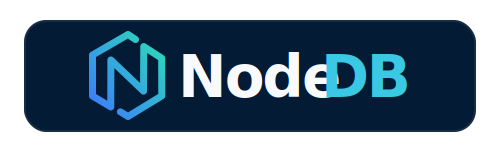

<div align="center">



# NodeDB Lite

<h3>The embedded multi-model database for local-first apps, agents, and edge runtimes.</h3>

<p>
  <a href="https://github.com/NodeDB-Lab/nodedb">NodeDB</a> engines in-process. One API.
  Zero server requirement. Run vector search, graph traversal, document queries, full-text search,
  timeseries, and other multi-model workloads on device, then sync to Origin when connectivity returns.
</p>

<p>
  <a href="#release-status"><strong>Release Status</strong></a>
  ·
  <a href="#platforms"><strong>Platforms</strong></a>
  ·
  <a href="#crdt-sync"><strong>CRDT Sync</strong></a>
  ·
  <a href="#performance"><strong>Performance</strong></a>
  ·
  <a href="https://github.com/NodeDB-Lab/nodedb"><strong>NodeDB Origin</strong></a>
</p>

<p align="center">
  <a href="https://discord.gg/s54gDMVc7B">
    
  </a> 
</p>

<p>
  <a href="https://github.com/NodeDB-Lab/nodedb-lite/actions/workflows/ci.yml">
    
  </a>
  
  <a href="https://github.com/NodeDB-Lab/nodedb-lite/blob/main/LICENSE">
    
  </a>
  <a href="https://github.com/NodeDB-Lab/nodedb-lite/stargazers">
    
  </a>
</p>

</div>

NodeDB Lite replaces the usual SQLite + vector sidecar + ad hoc cache + custom sync layer stack with one embedded engine. Local reads stay in-process, writes remain available offline, and the same application code can later sync to NodeDB Origin without a rewrite.

## Release Status

NodeDB Lite is in **public beta** as of **v0.1.0 (2026-05-23)**. All engines listed in [`docs/lite-support-matrix.md`](docs/lite-support-matrix.md) are feature-complete and covered by tests. The public surface — the `NodeDb` trait, the supported SQL plan variants, the C FFI ABI, and the WASM / npm bindings — is stable; clients written against 0.1.0 will keep working through 1.0.

**v0.1.0 — Beta (today).** Use it for embedded workloads and for piloting Lite ↔ Origin sync. The public surface is stable; expect internal changes (redb layout, on-disk index format, sync-protocol internals) between minor releases. Patch and minor bumps will land as needed.

**v1.0.0 — Production-ready (target: 2026-07-23).** What 1.0 guarantees:

- **API & SQL stability** — semver from 1.0 onward. No breaking changes to the `NodeDb` trait, the supported SQL plan variants, or the C FFI / WASM ABIs within a major.
- **Sync protocol stability** — the Lite ↔ Origin WebSocket wire frames frozen at the version Origin ships in its 1.0.
- **On-disk format stability** — no breaking migrations within 1.x. Forward-compatible upgrades only.
- **Platform parity** — iOS FFI built and tested against a macOS environment; Android JNI packaging fully gated.
- **Performance SLAs** — published p99 targets per engine, regression-gated in CI.
- **Security audit** — third-party audit completed and findings remediated before 1.0 ships.

Pre-1.0 versions may change internals between releases — that work is critical-path hardening (persistence layouts, sync coordination, platform packaging) that has to be exercised in real production conditions before we put a stability stamp on it. The public API, SQL surface, and sync wire frames won't break; everything underneath is fair game until 1.0.

> **Note:** This release track applies to **NodeDB Lite** only. [NodeDB Origin](https://github.com/NodeDB-Lab/nodedb), [`ndb` CLI](https://github.com/NodeDB-Lab/nodedb-cli), and [NodeDB Studio](https://github.com/NodeDB-Lab/nodedb-studio) are versioned independently on their own tracks.

## Why NodeDB Lite

- **One embedded engine, not a stitched-together client stack.** Vectors, graph, documents, full-text, timeseries, key-value, and other NodeDB data models run in one runtime with shared storage and one query surface.
- **Built for offline-first.** Every write is captured as a CRDT delta locally, then merged to Origin when the network comes back.
- **Same API as Origin.** The `NodeDb` trait is identical across Lite and server deployments, so moving from on-device to remote is a connection decision, not an architecture rewrite.
- **Edge-ready.** Linux, macOS, Windows, Android, and browser/WASM in `0.1.0`; iOS lands before `1.0`.

## When to Use

- Mobile apps that need to work offline
- AI agents that need local memory (vectors + graph + documents)
- Browser-based apps (WASM, target: < 10 MB)
- Desktop applications with local-first data
- IoT gateways with intermittent connectivity

## Platforms

| Platform                                  | Crate              | Backend                   | Size                                                               |
| ----------------------------------------- | ------------------ | ------------------------- | ------------------------------------------------------------------ |
| Linux                                     | `nodedb-lite`      | redb (file-backed)        | Native                                                             |
| macOS                                     | `nodedb-lite`      | redb (file-backed)        | Native                                                             |
| Windows                                   | `nodedb-lite`      | redb (file-backed)        | Native                                                             |
| Android                                   | `nodedb-lite-ffi`  | redb + C FFI + Kotlin/JNI | Native                                                             |
| iOS _(in progress — not in 0.1.0)_ | `nodedb-lite-ffi`  | redb + C FFI (cbindgen)   | Native _(requires macOS build environment — not yet built/tested)_ |
| Browser                                   | `nodedb-lite-wasm` | redb (in-memory + OPFS)   | Target: < 10 MB                                                    |

## Packages

```bash
# Rust
cargo add nodedb-lite

# JavaScript / TypeScript (browser + Node)
npm install @nodedb/lite
```

## Quick Start

The Rust crate API in `0.1.0`:

```rust
use nodedb_lite::{NodeDbLite, RedbStorage};
use nodedb_client::NodeDb;

// Open an in-memory database (peer_id uniquely identifies this device/replica):
let storage = RedbStorage::open_in_memory()?;
let db = NodeDbLite::open(storage, 1u64).await?;

// Insert a document
db.execute_sql("CREATE COLLECTION notes", &[]).await?;

// Put a document via the typed API
use nodedb_types::document::Document;
let mut doc = Document::new("n1");
doc.set("title", "Hello".into());
db.document_put("notes", doc).await?;

// Vector search
db.vector_insert("articles", "a1", &embedding, None).await?;
let results = db.vector_search("articles", &embedding, 10, None).await?;

// Graph traversal
use nodedb_types::id::NodeId;
let start = NodeId::try_new("alice")?;
let subgraph = db.graph_traverse("social", &start, 3, None).await?;
```

## Same API, Any Runtime

The `NodeDb` trait is identical across Lite and Origin. Application code doesn't change for the operations both implementations expose — Origin offers more (full SQL, Array DDL/DML, vector quantization, distributed search); see [`docs/lite-support-matrix.md`](docs/lite-support-matrix.md) for the exact Lite surface.

```rust
// Works with both NodeDbLite (in-process) and NodeDbRemote (over network)
async fn search(db: &dyn NodeDb, query: &[f32]) -> Result<Vec<Article>> {
    db.vector_search("articles", query, 10).await
}
```

Moving from embedded to server is a connection string change, not a rewrite.

## CRDT Sync

Every write produces a delta. Deltas sync to Origin over WebSocket when online. Multiple devices converge regardless of operation order.

```
Offline:    App writes locally -> Loro generates delta -> delta persisted to redb
Reconnect:  Device opens WebSocket -> sends vector clock + accumulated deltas
Cloud:      Origin validates (RLS, UNIQUE, FK) -> merges -> pushes back missed changes
Conflict:   Rejected deltas -> dead-letter queue + CompensationHint -> device handles
Converged:  Device and cloud share identical Loro state hash
```

- **Shape subscriptions** -- Control what data each device holds: `WHERE user_id = $me`, not the entire database
- **Conflict resolution** -- Declarative per-collection policies. SQL constraints (UNIQUE, FK) enforced on Origin at sync time with typed compensation hints back to the device.
- ACK-based flow control (AIMD), CRC32C delta integrity, JWT token refresh, replay dedup

## Key Features

- **Multi-model locally** -- Vector, graph, document, full-text, timeseries, key-value, and more, all in-process with no network
- **Sub-millisecond reads** -- Hot data lives in memory indexes (HNSW, CSR, Loro)
- **SQL** -- Supports a documented subset of NodeDB's SQL surface; see [SQL support](#sql-support) below.
- **Encryption at rest** -- AES-256-GCM + Argon2id key derivation
- **Memory governance** -- Per-engine budgets, pressure levels, LRU eviction

## SQL support

NodeDB Lite parses SQL via `nodedb-sql` and executes plans directly against local engines.
8 of 44 `SqlPlan` variants are executed in `0.1.0`: `ConstantResult`, `Scan` (partial),
`PointGet`, `Insert`, `Upsert`, `Update`, `Delete`, and `Truncate`. JOIN, aggregates, CTE,
window functions, vector/FTS/spatial SQL, and all Array DDL/DML variants return
`LiteError::Unsupported`. The regression gate is `tests/sql_matrix.rs`.

See [docs/lite-support-matrix.md](docs/lite-support-matrix.md) for the full engine, SQL, and sync support matrix.

## Performance

| Metric                                | Target    |
| ------------------------------------- | --------- |
| Vector search (1K vectors, 384d, k=5) | < 1ms p99 |
| Graph BFS (10K edges, 2 hops)         | < 1ms p99 |
| Document get                          | < 0.1ms   |
| Cold start (10K vectors + 100K edges) | < 500ms   |
| Sync round-trip (single delta)        | < 200ms   |
| WASM bundle                           | < 10 MB   |
| Mobile memory                         | < 100 MB  |

## Workspace

This repository contains three crates:

| Crate              | Description                                           |
| ------------------ | ----------------------------------------------------- |
| `nodedb-lite`      | Core embedded database library                        |
| `nodedb-lite-ffi`  | C FFI bindings for Android (cbindgen, Kotlin/JNI); iOS lands before 1.0 |
| `nodedb-lite-wasm` | JavaScript/TypeScript bindings via wasm-bindgen       |

## Building from Source

```bash
git clone https://github.com/NodeDB-Lab/nodedb-lite.git
cd nodedb-lite

# Build all crates
cargo build --release

# Build WASM
cargo build -p nodedb-lite-wasm --target wasm32-unknown-unknown --release

# Run tests
cargo test
```

For local development against the NodeDB workspace, create `.cargo/config.toml`:

```toml
[patch.crates-io]
nodedb-types = { path = "../nodedb/nodedb-types" }
nodedb-client = { path = "../nodedb/nodedb-client" }
nodedb-codec = { path = "../nodedb/nodedb-codec" }
nodedb-crdt = { path = "../nodedb/nodedb-crdt" }
nodedb-query = { path = "../nodedb/nodedb-query" }
nodedb-spatial = { path = "../nodedb/nodedb-spatial" }
nodedb-graph = { path = "../nodedb/nodedb-graph" }
nodedb-vector = { path = "../nodedb/nodedb-vector" }
nodedb-fts = { path = "../nodedb/nodedb-fts" }
nodedb-strict = { path = "../nodedb/nodedb-strict" }
nodedb-columnar = { path = "../nodedb/nodedb-columnar" }
nodedb-sql = { path = "../nodedb/nodedb-sql" }
```

## License

Apache-2.0. See [LICENSE](LICENSE) for details.
